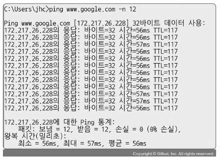
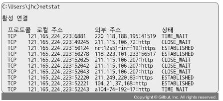
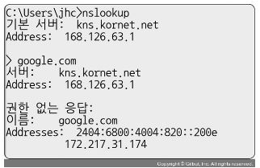

# 네트워크 모델(기준)
모듈화된 계층 구조를 사용하여 네트워크 기술의 표준화를 시도한 대표적인 네트워크 아키텍처 2개를 소개합니다 ...

**각 계층은 하위 계층의 서비스를 받으며 상위 계층에게 서비스를 제공**

**각 계층에서는 하위 계층으로부터 문제없이 서비스를 잘 받고, 실제로 어떻게 작동하는지 알 필요가 없다는 가정 하에 진행된다. 이러한 원칙은 투명성(Transparent)으로 널리 알려져 있다**

## 종류 

### TCP/IP 모델
##### 1960년대 말 미국방성의 연구에서 시작되어 1980년 초 프로토콜 모델로 공개 현재의 인터넷에서 컴퓨터들이 서로 정보를 주고받는데 쓰이는 통신 규약(프로토콜)의 모음이다

4계층 응용

3계층 전송

2게층 네트워크

1계층 네트워크 인터페이스   

### OSI 7계층 모델

##### 1984년 ISO에서 표준으로 지정한 모델로 데이터를 주고받을 때 데이터 자체의 흐름을 각 구간별로 나눠놓은 것
 
 7계층 응용 HTTP

 6계층 표현 SMB

 5계층 세션 Net

 4계층 전송 TCP, UDP

 3계층 네트워크 IP, ICMP, ARP

 2계층 데이터링크 이더넷 

 1계층 물리 전선, 전파, 모뎀 등 ...

### 비교

#### 공통점
- 계층적 네트워크 모델
- 계층간 역할 정의
#### 차이점
- 계층의 수 차이, 
- OSI는 역할기반, TCP/IP는 프로토콜 기반
- OSI는 통신 전반에 대한 표준(논리적인 느낌), TCP/IP는 데이터 전송기술 특화(실무적인 느낌)
- cs 지식으로는 osi로 많이 물어봄

** 어떤 사람들은 TCP의 1계층이 OSI의 1+2계층 .. 안나눠도 될걸 나눴다고도 한다 

---
## 패킷

### 네트워크 상에서 전달되는 데이터를 통칭하는 말

- 네트워크에서 전달하는 데이터의 형식화된 블록
- 패킷은 제어정보와 사용자 데이터로 이뤄지며 사용자 데이터는 페이로드라고 한다
- 패킷의 형태는 따로 정해져있지 않고 계속 추가될 수 있다.

**헤더-페이로드-풋터**

페이로드가 실질적인 데이터로, 풋터는 잘 사용하지 않음

### 패킷을 이용한 통신과정

캡슐화 : 여러 프로토콜을 이용해서 최종적으로 보낼 때 패킷을 만드는 과정
- 아래에서 위로 가는 일은 없다

디캡슐화 : 데이터를 받는 쪽에서 확인하는 과정

- 패킷을 받았을 때 프로토콜을 하나씩 확인하면서 데이터를 확인하는 과정 

#### 계층별 패킷의 이름 PDU

PDU : 패킷데이터 유닛

### 각 계층에서 패킷을 부르는 용어가 다르다

- 4계층 데이터에 TCP만 붙어있는 형태 : 세그먼트
- 3계층 : 패킷
- 2계층 : 프레임

    일반적으로 패킷이라고 하면 네트워크에서 왔다갔다하는 데이터의 총칭으로 느낌

    근데 프레임은 가끔 씀

## 네트워크 성능 분석 명령어
애플리케이션 코드상에는 전혀 문제가 없는데 사용자가 서비스로부터 데이터를 가져오지 못하는 상황이 발생하기도 하며, 이는 네트워크 병목 현상일 가능성이 있음

네트워크 병목현상의 주된 원인
- 네트워크 대역폭
- 네트워크 토폴로지
- 서버 CPU, 메모리 사용량
- 비효율적인 네트워크 구성

#### PING

Packet INternet Groper : 네트워크 상태를 확인하려는 대상 노드를 향해 일정 크기의 패킷을 전송하는 명령어

이를 통해 해당 노드의 패킷 수신 상태와 도달하기까지 시간 등을 알 수 있으며 해당 노드까지 네트워크가 잘 연결되어 있는지 확인할 수 있다. ping은 TCP/IP프로토콜 중 ICMP 프로토콜을 통해 동작하며, 이 때문에 ICMP 프로토콜을 지원하지 않는 기기를 대상으로는 실행할 수 없거나 네트워크 정책상 ICMP나 traceroute를 차단하는 대상의 경우 ping테스팅은 불가능하다. 
ping[IP 또는 도메인 주소]로 실행

#### netstat

접속되어 있는 서비스들의 네트워크 상태를 표시하는 데 사용되며 네트워크 접속, 라우팅 테이블, 네트워크 프로토콜 등 리스트를 보여줌. 주로 서비스의 포트가 열려있는지 확인할 때 사용

#### nslookup

DNS에 관련된 내용을 확인하기 위해 쓰는 명령어로 특정 도메인에 매핑된 IP를 확인하기 위해 사용
*DNS : IP 주소 및 기타 데이터를 저장하고 이름별로 쿼리할 수 있게 해주는 계층형 분산 데이터베이스

#### tracert 

윈도우에서는 tracert, 리눅스에서는 traceroute로 구동. 목적지 노드까지 네트워크 경로를 확인할 때 사용하는 명령어로 목적지 노드까지의 구간들 중 어느 구간에서 응답 시간이 느려지는지 등을 확인할 수 있다.

이외 ftp를 통해 대형 파일을 전송하여 테스팅하거나 tcpdump를 통해 노드로 오고 가는 패킷을 캡처하는 등의 명령어가 있으며 네트워크 분석 프로그램으로는 wireshark, netmon이 있음
